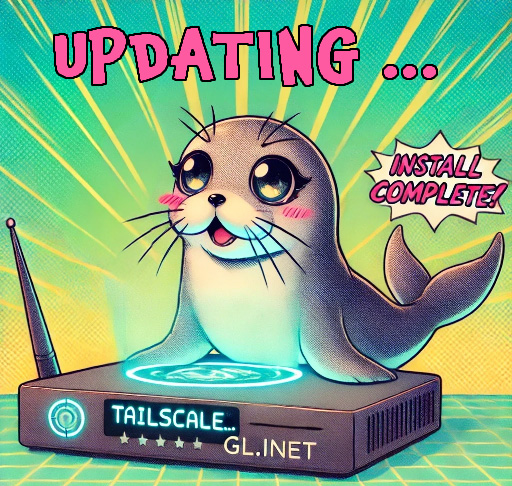

# Tailscale Update Script for GL.iNet Routers



This script is designed to update Tailscale on GL.iNet routers.

It was created by [Admon](https://forum.gl-inet.com/u/admon/) for the GL.iNet community and tested on the MT-6000 (Flint2) with firmware 4.5.4.

## Requirements

- GL.iNet router with firmware 4.x
- Supported architecture: arm64, armv7, mips
- Free space: at least 50 MB
- xz installed if you want to use UPX compression, if it's not installed, the script will install it for you

## Arguments

The `update-tailscale.sh` script supports the following arguments:

- `--ignore-free-space`: Ignores the free space check. Useful for devices with low free space. Use with caution!

- `--force`: Skips all confirmation prompts and makes the install permanent. Useful for unattended installations. Use with caution!

- `--restore`: Restores the original files (`/usr/sbin/tailscaled` and `/usr/sbin/tailscale`) from the firmware. Does not restore configuration files and may lead to a broken installation. Use with caution!

- `--no-upx`: Skips the UPX compression. The tailscale binaries will be larger but the update will be faster.

- `--no-download`: Skips the download of the tailscale binaries. Useful if you have already downloaded the binaries and want to use them. Store the archive as `/tmp/tailscale.tar.gz`.

- `--help`: Displays the help message with information about the available arguments.

## Quick start

You can run it without cloning the repository by using the following command:

```shell
wget -O update-tailscale.sh https://raw.githubusercontent.com/Admonstrator/glinet-tailscale-updater/main/update-tailscale.sh && sh update-tailscale.sh
```

**Please do not run this script as a cron job! It is recommended to run it manually!**

## Force update

By using the --force option, the script will skip all confirmation prompts. It will make the install permanent. This is useful for unattended installations. In combination with --ignore-free-space, it will also skip the free space check. Please use with caution!

## Running on devices with low free space

You can use --ignore-free-space to ignore the free space check. This is useful for devices with low free space. Please use with caution!

## UPX compression

The script uses UPX to compress the tailscale binaries. You will be asked if you want to use UPX compression. It is recommended to use UPX compression, as it will reduce the size of the tailscale binaries. If you choose not to use UPX compression, the script will still work, but the tailscale binaries will be larger.

## Restoring the original files

You can use `--restore` to restore the original files. This will replace the `/usr/sbin/tailscaled` and `/usr/sbin/tailscale` files with the original files coming from the firmware. It will not restore your configuration files and might lead to a broken installation. Please use with caution!

## Feedback

Feel free to provide feedback in the [GL.iNet forum](https://forum.gl-inet.com/t/how-to-update-tailscale-on-arm64/37582).

## Disclaimer

This script is provided as is and without any warranty. Use it at your own risk.

**It may break your router, your computer, your network or anything else. It may even burn down your house.**

**You have been warned!**

## Contributers

Thanks to [lwbt](https://github.com/lwbt) for the UPX compression!
