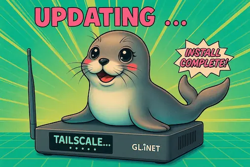

<div align="center">

# 🦭 Tailscale Updater for GL.iNet Routers

[](https://github.com/Admonstrator/glinet-tailscale-updater/releases/latest)
[](https://github.com/Admonstrator/glinet-tailscale-updater)
[](LICENSE)

[](https://github.com/sponsors/admonstrator)
[](https://buymeacoffee.com/admon)
[](https://ko-fi.com/admon)
[](https://paypal.me/aaronviehl)



**Keep Tailscale up-to-date on your GL.iNet router with ease!**

Created by [Admon](https://forum.gl-inet.com/u/admon/) for the GL.iNet community
Tested on nearly all GL.iNet routers with firmware 4.x

[Quick Start](#-quick-start) • [Documentation](#-arguments) • [Support](#-feedback) • [Contributing](#-contributors)

</div>

---

## ✨ Features

- 🚀 **Automatic Updates** - Fetches and installs the latest Tailscale version
- 📦 **Tiny Version Support** - Uses optimized tiny binaries to save space
- 🗜️ **UPX Compression** - Further reduces binary size when needed
- 🔒 **Tailscale SSH ready** - Enables secure SSH access to the router via Tailscale
- 🎯 **Version Selection** - Install specific Tailscale versions
- 🔧 **Stateful Filtering** - Auto-configures for exit node compatibility
- 🛡️ **Safe Restore** - Restore original firmware binaries if needed
- ⚡ **Flexible Options** - Multiple flags for customized installations

---

## 📋 Requirements

| Requirement      | Details                                                        |
| ---------------- | -------------------------------------------------------------- |
| **Router**       | GL.iNet router with firmware 4.x (including GL-BE9300 Flint 3) |
| **Architecture** | arm64, armv7, mips, mipsle, or x86_64                          |
| **Free Space**   | At least 15 MB (can be bypassed with `--ignore-free-space`)    |
| **Dependencies** | `xz` (auto-installed if missing and UPX compression is used)   |

---

## 🚀 Quick Start

Run the updater without cloning the repository:

```bash
wget -O update-tailscale.sh https://raw.githubusercontent.com/Admonstrator/glinet-tailscale-updater/main/update-tailscale.sh && sh update-tailscale.sh
```

> ⚠️ **Important:** Do not run this script as a cron job! Manual execution is recommended.


## 🎛️ Arguments

The `update-tailscale.sh` script supports the following arguments:

| Argument              | Description                                                                                                                      |
| --------------------- | -------------------------------------------------------------------------------------------------------------------------------- |
| `--ignore-free-space` | Bypasses the free space check. Use with caution on low-storage devices!                                                          |
| `--force`             | Skips all confirmation prompts and makes installation permanent. Ideal for unattended installations.                             |
| `--force-upgrade`     | Forces upgrade even if the current version is already up to date. Useful for reinstalling the same version.                      |
| `--restore`           | Restores original firmware binaries (`/usr/sbin/tailscaled` and `/usr/sbin/tailscale`). ⚠️ Does not restore config files!         |
| `--no-upx`            | Skips UPX compression. Binaries will be larger but installation is faster.                                                       |
| `--no-download`       | Skips downloading binaries. Use pre-downloaded archive at `/tmp/tailscale.tar.gz`.                                               |
| `--no-tiny`           | Uses full Tailscale binaries instead of tiny version. Not recommended for GL.iNet routers.                                       |
| `--select-release`    | Displays available releases and lets you choose a specific version. ⚠️ Downgrading not officially supported!                      |
| `--testing`           | Uses prerelease/testing versions from the testing branch. ⚠️ **Use at your own risk!** May contain bugs or experimental features. |
| `--ssh`               | Enables Tailscale SSH feature after installation.                                                                                |
| `--log`               | Shows timestamps in all log messages. Useful for debugging and tracking execution time.                                          |
| `--ascii`             | Uses ASCII characters (`[OK]`, `[X]`, `[!]`, `[->]`) instead of emojis for compatibility with older terminals.                   |
| `--help`              | Displays help message with all available arguments.                                                                              |

---

## 📚 Usage Examples

### Testing/Prerelease Versions

Install prerelease versions from the testing branch for early access to new features:

```bash
wget -O update-tailscale.sh https://raw.githubusercontent.com/Admonstrator/glinet-tailscale-updater/main/update-tailscale.sh && sh update-tailscale.sh --testing
```

> **⚠️ Warning:** Testing versions are experimental and may contain bugs or unstable features. Use at your own risk!

### Select a Specific Version

Install a specific Tailscale version (useful if the latest version has issues):

```bash
wget -O update-tailscale.sh https://raw.githubusercontent.com/Admonstrator/glinet-tailscale-updater/main/update-tailscale.sh && sh update-tailscale.sh --select-release
```

The script will display available releases for you to choose from.

> **⚠️ Warning:** Downgrading Tailscale is not officially supported and may cause unexpected behavior.

### Force Update (Unattended Installation)

Skip all prompts and make the installation permanent:

```bash
sh update-tailscale.sh --force
```

Combine with `--ignore-free-space` for devices with limited storage:

```bash
sh update-tailscale.sh --force --ignore-free-space
```

### Restore Original Binaries

Revert to the original firmware binaries:

```bash
sh update-tailscale.sh --restore
```

> **⚠️ Caution:** This does not restore configuration files and may result in a broken installation.

### Logging and Output Options

Enable timestamps for debugging or tracking execution time:

```bash
sh update-tailscale.sh --log
```

Use ASCII characters instead of emojis for compatibility with older terminals:

```bash
sh update-tailscale.sh --ascii
```

Combine both options:

```bash
sh update-tailscale.sh --log --ascii
```

---

## 🔍 Key Features Explained

### 🎯 Tailscale Stateful Filtering

The script automatically adds `--stateful-filtering=false` to the `gl_tailscale` script. This is required for proper exit node functionality on GL.iNet routers. The modification is:
- ✅ Applied automatically
- ✅ Permanent (survives firmware upgrades)
- ✅ No manual configuration needed

### 🔐 Tailscale SSH ready

If you agree to enable Tailscale SSH during installation (manually or by using `--ssh`), the script will automatically configure Tailscale SSH after updating. You can read more about Tailscale SSH [here](https://tailscale.com/kb/1193/tailscale-ssh).

**⚠️ Warning:** If you are connected to your router via Tailscale SSH, you will be disconnected when SSH support is enabled. This might cause the script to terminate prematurely. It is recommended to run the script via local SSH or via GoodCloud SSH terminal.

### 📦 Tiny-Tailscale

By default, the script uses optimized tiny binaries that:
- 🔹 Significantly reduce storage footprint
- 🔹 Maintain full functionality
- 🔹 Skip UPX compression (already optimized)
- 🔹 Are recommended for all GL.iNet routers

Use `--no-tiny` if you need the full-sized binaries.

### 🗜️ UPX Compression

For standard (non-tiny) binaries, UPX compression:
- 🔹 Substantially reduces binary size
- 🔹 Is recommended for storage-limited devices
- 🔹 Requires `xz` (auto-installed if missing)
- 🔹 Can be disabled with `--no-upx`

---

## 💬 Feedback

Have questions or feedback? Join the discussion in the [GL.iNet forum](https://forum.gl-inet.com/t/how-to-update-tailscale-on-arm64/37582).

---

## ⚠️ Disclaimer

This script is provided **as-is** without any warranty. Use it at your own risk.

**It may potentially:**
- 🔥 Break your router, computer, or network
- 🔥 Cause unexpected system behavior
- 🔥 Even burn down your house (okay, probably not, but you get the idea)

**You have been warned!**

---

## 👥 Contributors

Special thanks to:

- **[lwbt](https://github.com/lwbt)** - UPX compression & tiny-tailscale feature
- **[Aubermean](https://github.com/Aubermean)** - Clarification of `--stateful-filtering=false` ([#1](https://github.com/Admonstrator/glinet-tailscale-updater/issues/1))
- **[all the testers and feedback providers in the GL.iNet forum!]**
- **Copilot** - Yeah, I am using AI to help write code. But I review and test everything thoroughly!

Want to contribute? Pull requests are welcome!

---

## 💖 Support the Project

If you find this script helpful, consider supporting its development:

[](https://github.com/sponsors/admonstrator)
[](https://buymeacoffee.com/admon)
[](https://ko-fi.com/admon)
[](https://paypal.me/aaronviehl)

---

<div align="center">

**Made with ❤️ by [Admon](https://github.com/Admonstrator)**

[⬆ Back to Top](#-tailscale-updater-for-glinet-routers)

</div>
